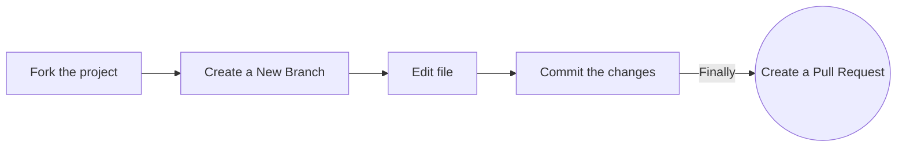

# Our Community Members
This repo is created to document members of this wonderful community🚀

Create a Pull request to **start**your  open-source journey! 🎉

### Add your name to the alphabetical list and, optionally, a link to your GitHub account (in alphabetical order below your letter too)

### Option 1. Complete this process in GitHub (in your browser)

1. Fork the project:

- Click the gray <kbd>Fork</kbd> button at the top right of this page. This creates your copy of the project and saves it as a new repository in your GitHub account

2. Create a New Branch:

- On your new repository's page, click the gray main button in the upper left to reveal a dropdown menu.
- Enter the name of your new branch in the text box. (Branch names usually refer to what is being changed. Example: nameAdd).
-Click on Create branch <new branch name>, which will automatically take you to your new branch. You can make edits on the main branch, but this may cause issues down the line. The best practice is to create a new branch for each separate issue you work on. That way your main branch remains in sync with Eddie's main branch.

3. Edit:

- On the top right of the Readme file, click on the pencil icon to edit the file by adding your name.
- After editing the Readme file, add a commit message and click on the green button saying "Commit Changes". Make sure you have selected the branch you have created.

4. Raise a Pull Request:

- Click `Pull Requests` (which is the third option at the top of this page after the options `Code` and `Issues`).
- Click the green New Pull Request button. This will prep the new pull request for you by auto-filling the base repository: base with '<<\BRIAN KEPHA>>: main' AND auto-filling your head repository: compare with your repository: main
- Click on your head repository's `compare` dropdown, and switch branches from your 'main' branch to `<new branch name>`.
- Finally, click the green `Create Pull Request` button. Great job! You did it!

### **Contents**
| [A](#a) | [B](#b) | [C](#c) | [D](#d) | [E](#e) | [F](#f) | [G](#g) | [H](#h) | [I](#i) | [J](#j) | [K](#k) | [L](#l) | [M](#m) | [N](#n) | [O](#o)
| [P](#p) | [Q](#q) | [R](#r) | [S](#s) | [T](#t) | [U](#u) | [V](#v) | [W](#w) | [X](#x) | [Y](#y) | [Z](#z) |

- ### **A**
- ### **B**
[Brian Kepha](https://github.com/AngelofVerdant)
- ### **C**
- ### **D**
- ### **E**
- ### **F**
- ### **G**
- ### **H**
- ### **I**
- ### **J**
- ### **K**
- ### **L**
- ### **M**
- ### **N**
- ### **O**
- ### **P**
- ### **Q**
- ### **R**
- ### **S**
- ### **T**
- ### **U**
- ### **V**
- ### **W**
- ### **X**
- ### **Y**
- ### **Z**

| [Back To Top](#contents) |
